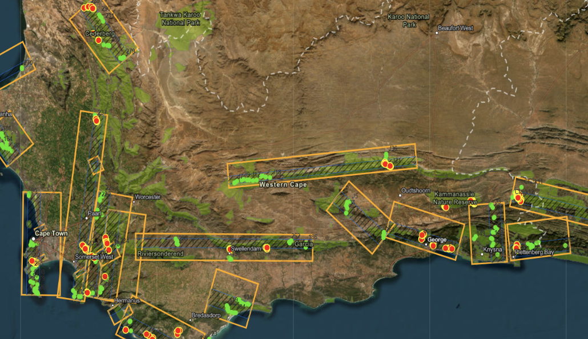
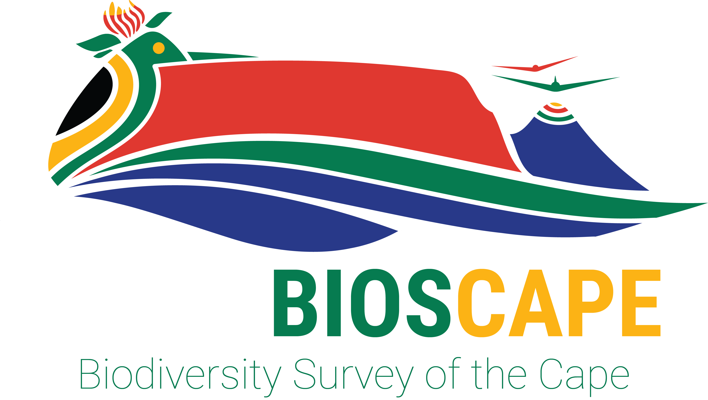
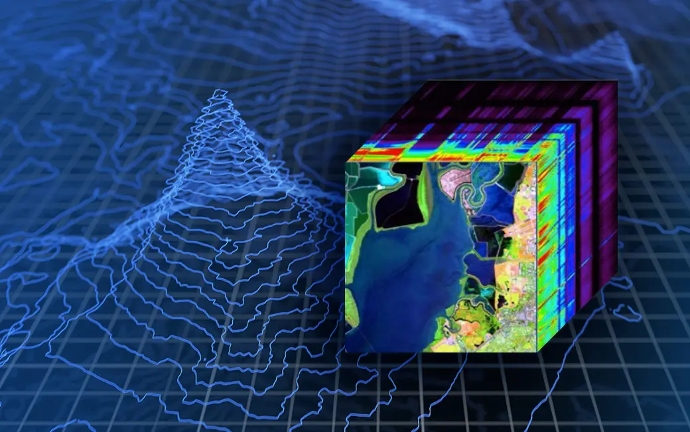
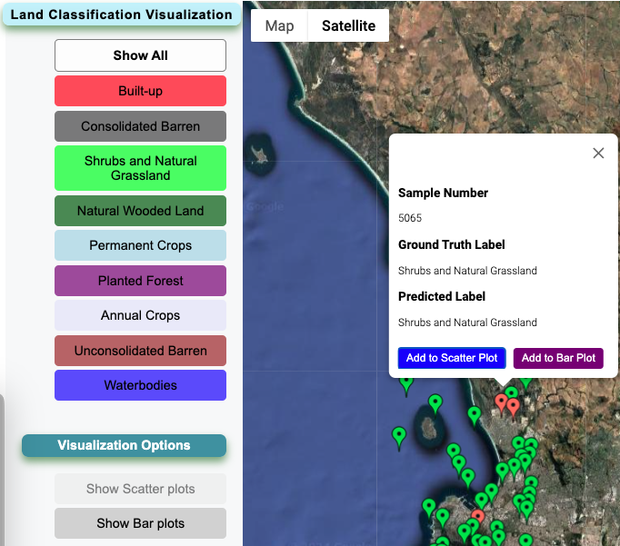
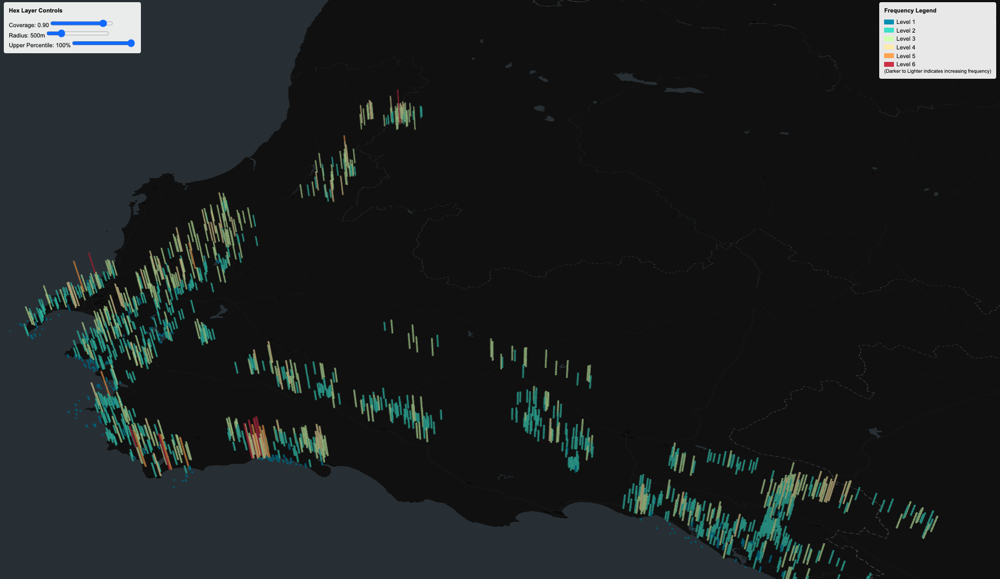
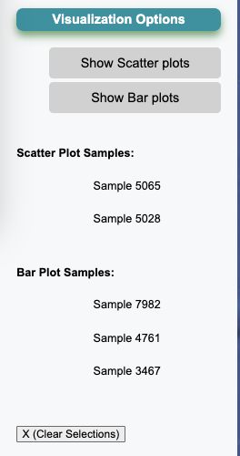
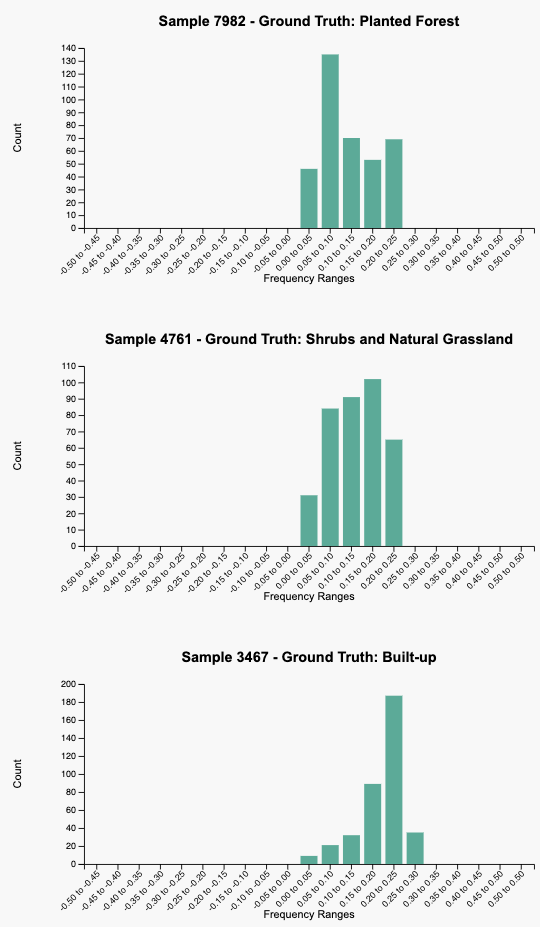

# Hyperspectral Land Cover Classification Visualization

The underlying ML model and classification process are described in more detail in the [Hyperspectral-Landcover-Classification](https://github.com/harrisb002/Hyperspectral-Landcover-Classification) repository.

This project provides an interactive, web-based visualization platform for exploring hyperspectral land cover classification
results derived from AVIRIS-NG imagery. It integrates geospatial data, predictions from a machine learning (ML) model,
and aggregated frequency data into a coherent visual interface, enabling researchers, ecologists, and stakeholders
to intuitively understand and analyze landscape patterns in the Greater Cape Floristic Region of South Africa.

<div>
  <a href="https://github.com/harrisb002/hsi_visualization">
    
  </a>
  <a href="https://github.com/harrisb002/hsi_visualization">
    
  </a>
</div>

## About The Project

### A Larger Initiative: BioSCape

This work aligns with the BioSCape research project—a collaboration between NASA, the South African National Space Agency (SANSA),
and associated institutions—focused on biodiversity mapping and ecological understanding in the Greater Cape Floristic Region.
Leveraging high-fidelity hyperspectral data, this platform helps make complex spectral classification results accessible and actionable.

<a href="https://github.com/harrisb002/hsi_visualization">
  
</a>

## Background

The underlying ML model and classification process are described in more detail in the
[Hyperspectral-Landcover-Classification](https://github.com/harrisb002/Hyperspectral-Landcover-Classification) repository.
Using AVIRIS-NG hyperspectral images (432 spectral bands), a range of land cover types have been classified, including:

<a href="https://github.com/harrisb002/hsi_visualization">
  
</a>

- Planted Forest
- Permanent Crops (e.g., vineyards)
- Unconsolidated Barren
- Natural Grassland
- Consolidated Barren (e.g., rocks, salt pans)
- Built-up Areas
- Natural Wooded Land
- Waterbodies
- Annual Crops (e.g., wheat)
- Shrubs

These classifications are critical for understanding biodiversity distribution, habitat quality, and land-use changes,
all of which support ecological research, conservation planning, and resource management within the BioSCape initiative.

## Features and Functionalities

### Geospatial Visualization with Google Maps

The platform uses the Google Maps API for an intuitive spatial interface:

- **Marker-based Visualization:**  
  Classified sample points are displayed as markers on a satellite basemap. Green markers indicate
  correctly predicted labels (based on ground truth), while red markers indicate discrepancies.

  **Example (Marker Map with Predictions):**  
  <a href="https://github.com/harrisb002/hsi_visualization">
  
  </a>

- **Category-Based Filtering:**  
  A sidebar allows users to filter land cover samples by category. Choosing a category (e.g., "Shrubs and Natural Grassland")
  highlights only those samples, making pattern recognition straightforward.

- **Interactive Info Windows:**  
  Clicking a marker displays detailed metadata: sample number, ground truth label, predicted label,
  and options to add the sample to further analytical plots (e.g., scatter or bar plots).

  <a href="https://github.com/harrisb002/hsi_visualization">
    
  </a>

### Hexagon Layer Visualization

Beyond simple markers, the tool can display aggregated frequency data using a hexagonal binning layer powered by [deck.gl](https://deck.gl/):

- **Pre-Aggregated Frequency Sums:**  
  Frequency values from hyperspectral samples are aggregated and stored in a MongoDB backend, enabling quick retrieval of summarized data. This reduces memory load and improves performance.

- **3D Hexagon Layer:**  
  A HexagonLayer renders vertical columns at sample locations, with height and color encoding frequency sums. This provides an immediate sense of spatial distribution and intensity patterns across the landscape.

  

- **Adjustable Parameters:**  
  A control panel allows real-time adjustments of coverage, radius, and upper percentile parameters, enabling dynamic exploration of spatial frequency distributions.

### Bar and Scatter Plots for Detailed Analysis

For deeper dives into spectral distributions:

- **Bar Plot:**  
  Users can select individual samples and generate histograms (bar plots) of frequency distributions.

    <a href="https://github.com/harrisb002/hsi_visualization">
    
  </a>

  This allows closer inspection of the underlying spectral frequency ranges for a chosen sample, revealing how spectral values cluster within intervals.

  

- **Scatter Plot (for Frequencies):**  
  Users can also view scatter plots for selected frequency bands or combinations thereof, helping them identify relationships or anomalies in spectral signatures.

### Backend Integration and Data Handling

- **MongoDB Backend:**  
  All polygon coordinates, ground truth labels, predicted labels, and frequency summaries are stored in MongoDB. This ensures:

  - Efficient retrieval of polygons and predictions.
  - Scalable and flexible data management, especially for large datasets.
  - The ability to serve complex queries (e.g., filtering by `sample_num` or retrieving frequency summaries on-demand).

- **Node.js and Express Server:**  
  A Node.js/Express backend provides RESTful API endpoints (`/api/polygons`, `/api/samples`, `/api/frequency_summary`, `/api/predictions`) that frontend components fetch for seamless integration.

### Core Technologies and Libraries

- **Frontend:**

  - **React**: Frontend library for building the interactive UI.
  - **Google Maps JavaScript API**: Map visualization and markers for spatial orientation.
  - **deck.gl**: Advanced geospatial visualization, especially for hex layers.
  - **D3.js**: For building dynamic histograms, scatter plots, and other custom visualizations.
  - **CSS and Custom Hooks**: Ensuring clean UI and modular data fetching with `useData()`.

- **Backend:**

  - **Node.js & Express**: RESTful API and server logic.
  - **Mongoose** (MongoDB ODM): Storing and retrieving large hyperspectral datasets, predictions, and pre-aggregated frequency summaries.

- **Data Processing and ML Reference:**
  - **Hyperspectral-Landcover-Classification** project: Pre-trained ML models and classification logic, providing the predicted labels and frequency data that this visualization leverages.

### Use Cases and Applications

- **Ecological Research and Conservation**:  
  Understanding spatial patterns of vegetation types, habitat extents, and biodiversity distributions.
- **Policy and Resource Management**:  
  Informing conservation policies, land-use planning, and environmental monitoring efforts.
- **Academic and Educational Purposes**:  
  A teaching tool for remote sensing techniques, hyperspectral data analysis, and geospatial visualization.
- **Supporting the BioSCape Initiative**:  
  Facilitating cross-disciplinary research by making rich ecological datasets accessible and interactively analyzable.

---

## Getting Started

1. **Prerequisites**:

   - Node.js and npm installed locally.
   - A MongoDB database (Atlas or local) with the required collections (`samples`, `polygons`, `predictions`, `frequency_summary`).

2. **Setup**:

   - Clone the repository.
   - Run `npm install` to install dependencies.
   - Set environment variables in a `.env` file at the project root:
     ```env
     REACT_APP_GOOGLE_MAPS_API_KEY=YOUR_GOOGLE_MAPS_API_KEY
     MONGODB_URI=YOUR_MONGODB_CONNECTION_STRING
     REACT_APP_BACKEND_URL=http://localhost:4000
     ```

3. **Run the Server**:

   - `node server.js`

4. **Run the Frontend**:
   - `npm start` for a development environment.

Access the application at `http://localhost:3000` (or as configured) to explore the map, polygons, markers, hex layers, scatter and bar plots.

---
